# Neural-Art-Tensorflow
An implementation of the paper [A Neural Algorithm of Artistic Style](https://arxiv.org/pdf/1508.06576v2.pdf)

<p align="center">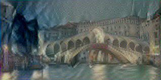</img>&nbsp;&nbsp;&nbsp;&nbsp;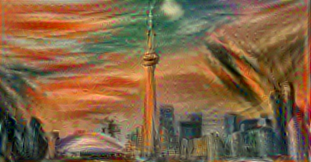</img>&nbsp;&nbsp;&nbsp;&nbsp;
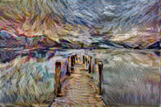</img>&nbsp;&nbsp;&nbsp;&nbsp;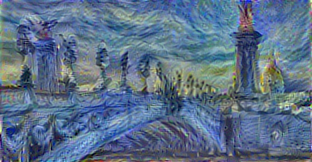</img>&nbsp;&nbsp;&nbsp;&nbsp;
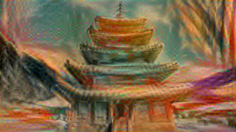</img>&nbsp;&nbsp;&nbsp;&nbsp;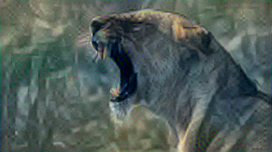</img>&nbsp;&nbsp;&nbsp;&nbsp;
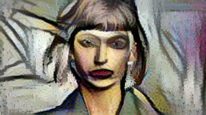</img>&nbsp;&nbsp;&nbsp;&nbsp;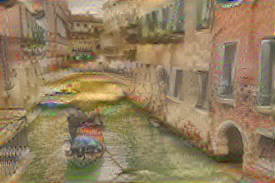</img>&nbsp;&nbsp;&nbsp;&nbsp;
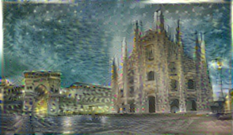</img>&nbsp;&nbsp;&nbsp;&nbsp;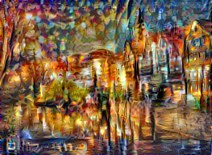</img>&nbsp;&nbsp;&nbsp;&nbsp;
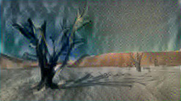</img>&nbsp;&nbsp;&nbsp;&nbsp;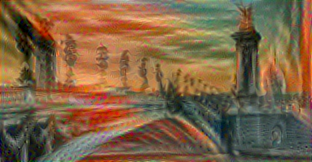</img>&nbsp;&nbsp;&nbsp;&nbsp;
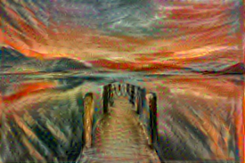</img>&nbsp;&nbsp;&nbsp;&nbsp;
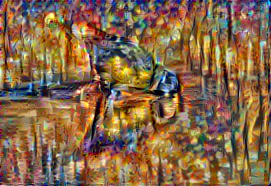</img>&nbsp;&nbsp;&nbsp;&nbsp;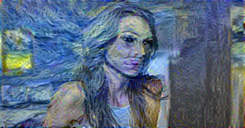</img>&nbsp;&nbsp;&nbsp;&nbsp;
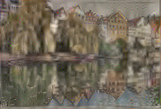</img>&nbsp;&nbsp;&nbsp;&nbsp;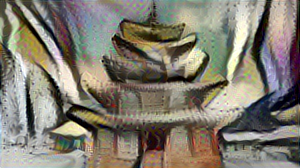</img>&nbsp;&nbsp;&nbsp;&nbsp;
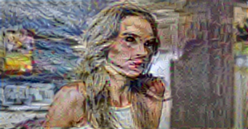</img>&nbsp;&nbsp;&nbsp;&nbsp;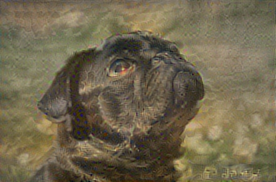</img>&nbsp;&nbsp;&nbsp;&nbsp;
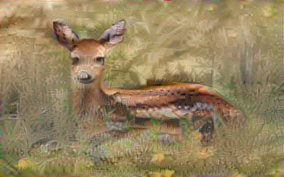</img>&nbsp;&nbsp;&nbsp;&nbsp;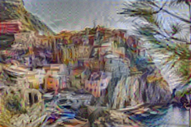</img>&nbsp;&nbsp;&nbsp;&nbsp;
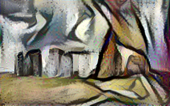</img>&nbsp;&nbsp;&nbsp;&nbsp;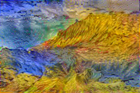</img>&nbsp;&nbsp;&nbsp;&nbsp;
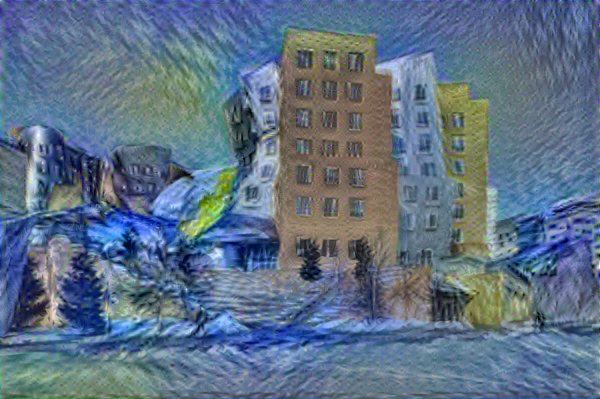</img>&nbsp;&nbsp;&nbsp;&nbsp;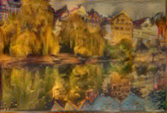</img>&nbsp;&nbsp;&nbsp;&nbsp;
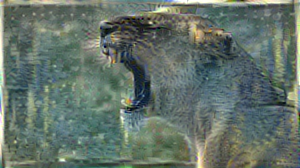</img>&nbsp;&nbsp;&nbsp;&nbsp;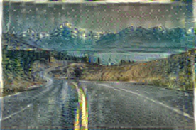</img>&nbsp;&nbsp;&nbsp;&nbsp;
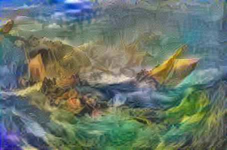</img>&nbsp;&nbsp;&nbsp;&nbsp;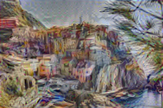</img>&nbsp;&nbsp;&nbsp;&nbsp;
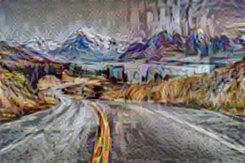</img>&nbsp;&nbsp;&nbsp;&nbsp;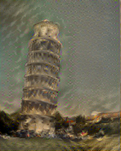</img>&nbsp;&nbsp;&nbsp;&nbsp;
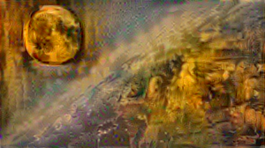</img>&nbsp;&nbsp;&nbsp;&nbsp;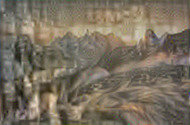</img>&nbsp;&nbsp;&nbsp;&nbsp;
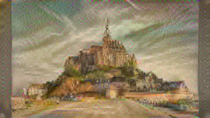</img>&nbsp;&nbsp;&nbsp;&nbsp;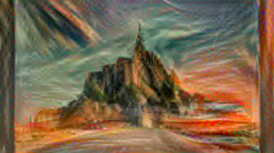</img>&nbsp;&nbsp;&nbsp;&nbsp;
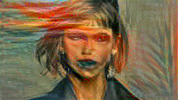</img>&nbsp;&nbsp;&nbsp;&nbsp;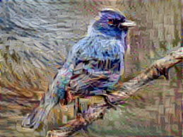</img>&nbsp;&nbsp;&nbsp;&nbsp;
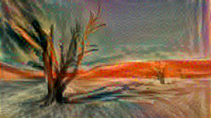</img>&nbsp;&nbsp;&nbsp;&nbsp;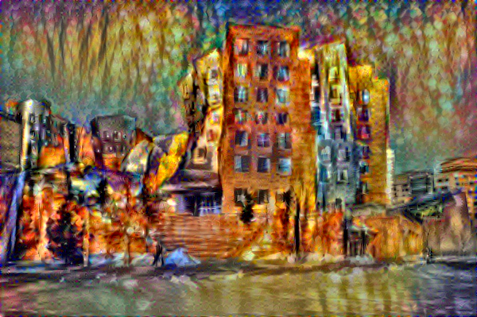</img>&nbsp;&nbsp;&nbsp;&nbsp;
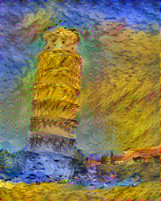</img>&nbsp;&nbsp;&nbsp;&nbsp;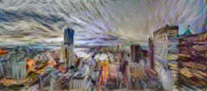</img>&nbsp;&nbsp;&nbsp;&nbsp;
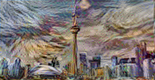</img>&nbsp;&nbsp;&nbsp;&nbsp;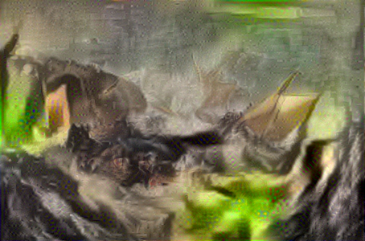</img>&nbsp;&nbsp;&nbsp;&nbsp;
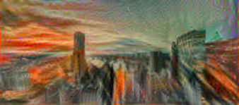</img>&nbsp;&nbsp;&nbsp;&nbsp;</p>  
  
  # Implementation
  
  Download the repository and run the following- 
  ```
  pip install -r requirements.txt
  python neural_style.py --content <path to content image> --styles <path to style images> --output <result destination>
  ```
  
  # Requirements  
  
  __Data Files__  
  
  Pre-Trained VGG Network (VGG19) weights can downloaded from [here](http://www.vlfeat.org/matconvnet/models/imagenet-vgg-verydeep-19.mat) and should be placed in the top level of the repository. In case you wish to specify a different location then use the `--network` flag.  
  
  __Dependencies__
  
  ```
  numpy
  Pillow
  scipy==1.1
  tensorflow-gpu >=1.0, <2.0 # works for cpu as well
  ```
  
  # Results  
  
  <p align="center">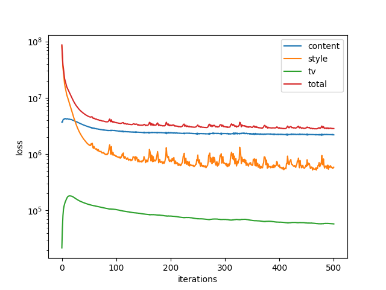</img>&nbsp;&nbsp;&nbsp;&nbsp;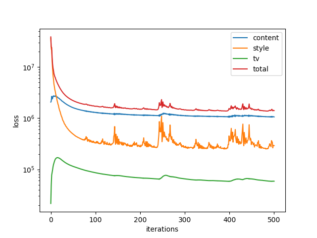</img>&nbsp;&nbsp;&nbsp;&nbsp;
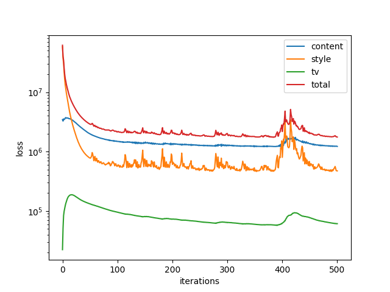</img>&nbsp;&nbsp;&nbsp;&nbsp;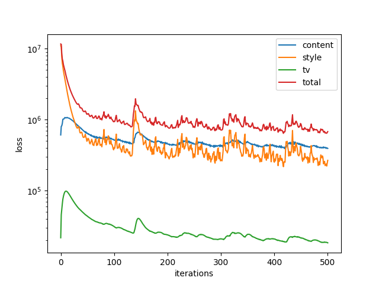</img>&nbsp;&nbsp;&nbsp;&nbsp;
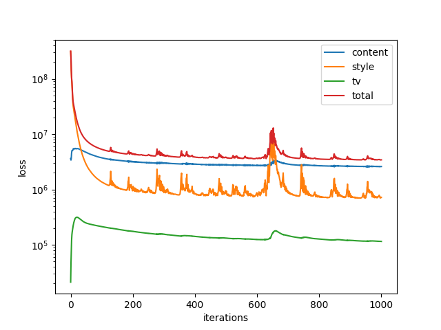</img>&nbsp;&nbsp;&nbsp;&nbsp;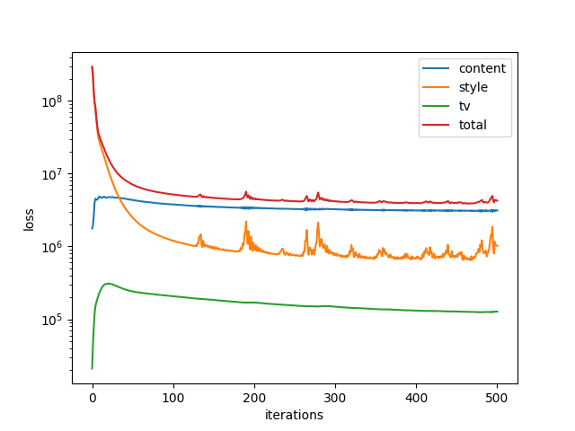</img>&nbsp;&nbsp;&nbsp;&nbsp;
</img>&nbsp;&nbsp;&nbsp;&nbsp;</img>&nbsp;&nbsp;&nbsp;&nbsp;
</img>&nbsp;&nbsp;&nbsp;&nbsp;</img>&nbsp;&nbsp;&nbsp;&nbsp;
</img>&nbsp;&nbsp;&nbsp;&nbsp;</img>&nbsp;&nbsp;&nbsp;&nbsp;
</img>&nbsp;&nbsp;&nbsp;&nbsp;
</img>&nbsp;&nbsp;&nbsp;&nbsp;</img>&nbsp;&nbsp;&nbsp;&nbsp;
</img>&nbsp;&nbsp;&nbsp;&nbsp;</img>&nbsp;&nbsp;&nbsp;&nbsp;
</img>&nbsp;&nbsp;&nbsp;&nbsp;</img>  

# Citation
If you use this implementation in your work then please cite the following:
```
@misc{karush17neuralart,
  author = {Karush Suri},
  title = {Neural Art},
  year = {2020},
  howpublished = {\url{https://github.com/karush17/Neural-Art-Tensorflow}},
  note = {commit xxxxxxx}
}
```  

# References  
1. [A Neural Algorithm of Artistic Style](https://arxiv.org/pdf/1508.06576v2.pdf)  
2. [PyTorch Implementation](https://github.com/animesh-s/Neural-Style-Transfer)
3. [Medium Blog Post](https://towardsdatascience.com/a-neural-algorithm-of-artistic-style-a-modern-form-of-creation-d39a6ac7e715)
4. [Notes on Variational Denoising](https://en.wikipedia.org/wiki/Total_variation_denoising)

 
# License  
Copyright 2020 Karush Suri. Released under MIT License. See [LICENSE](https://github.com/karush17/Neural-Art-Tensorflow/blob/master/LICENSE) for details. 
  
  
  


